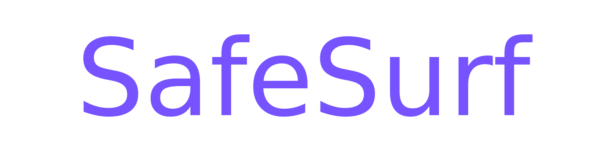
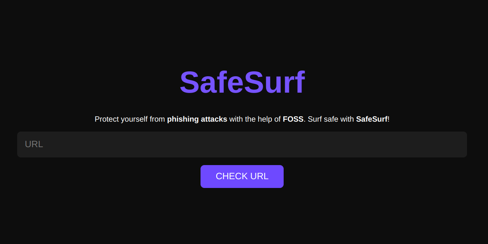

# SafeSurf

A phishing domain detection tool that also allows you to safely view the website without actually visiting it. Built using Python. With SafeSurf, you can quickly identify suspicious websites and protect yourself from phishing attacks.


## Features

These are the features provided by SafeSurf to its users.
- The website is easy to use, with a simple interface that anyone can navigate.
- Users can see the preview of the website without actually visiting it.
- SafeSurf gives a trust score to the URL, which will provide the user an understanding of the trustability and authenticity of the domain.
- The URL is checked with a phish database (PhishTank) to see whether it is a reported phishing link.
- SafeSurf provides crucial details (WHOIS, SSL and general) regarding the domain, which will help the user to get a basic understanding of the URL.

## Demo

https://safesurf.vercel.app


<br>

## Local Setup
If you find this project useful or interesting, please consider starring it and putting it on your watch list.

To run the application on your system, you can choose one of the following methods:

### A. Using Docker (Recommended)
If you have Docker installed on your computer, you can easily run the application by executing the following commands.

1. Clone the repository: 

```shell
git clone https://github.com/abhizaik/SafeSurf.git
cd SafeSurf
```

2. Start the container
```shell
docker-compose up -d
```

3. Open your web browser and go to http://localhost:5000 to use the application locally.

### B. Manual Setup
Alternatively, you can manually set up the project by following these steps. Note that you may encounter issues with Python libraries, depending on your Python version and the libraries already installed on your system.

1. Clone the repository: 

```shell
git clone https://github.com/abhizaik/SafeSurf.git
cd SafeSurf
```

2. Install the dependencies: 

```shell
pip install -r requirements.txt
```

3. Start the Flask app: 

```shell
python app.py
```

4. Open your web browser and go to http://localhost:5000 to use the application locally.


## Learn and Contribute to the Project
  
  <details>
  <summary> <b> Learn How SafeSurf Works </b> </summary>

  ### Project Functionality Overview

This section explains the functionality and inner workings of the project, detailing its key components and processes.

### API Endpoints 
- `/`: Homepage of the application where users can input a URL to assess its safety.
- `/preview`: Endpoint to view a preview of the website within SafeSurf.
- `/source-code`: Endpoint to view the source code of a website.

[Detailed code documentaion of SafeSurf](README-HOW-SAFESURF-WORKS.md)


</details>

<details>
  <summary> <b> How to Contribute to SafeSurf </b> </summary>

### Contributing Guidelines
Contributions are always welcome. If you find this project useful or interesting, please consider starring it and putting it on your watch list. If you want to contribute to the project, here's how you can do it:

1. Fork the repository to your GitHub account
2. Clone the forked repository to your local machine: 

```shell
git clone https://github.com/yourusername/SafeSurf.git
```

3. Create a new branch for your changes:

```shell
git checkout -b name-of-your-branch
```

4. Make your changes to the code
5. Commit your changes: 

```shell
git commit -m "your commit message"
```

6. Push your changes to your forked repository: 

```shell
git push origin name-of-your-branch
```

7. Create a pull request from your forked repository to the main repository
8. Wait for your changes to be reviewed and merged
   
   </details>


## Feedback

If you have any feedback or suggestions, please reach out at https://abhishekkp.com/contact/ or start a discussion on [SafeSurf Discussions](https://github.com/abhizaik/SafeSurf/discussions).

Any input is highly appreciated.
